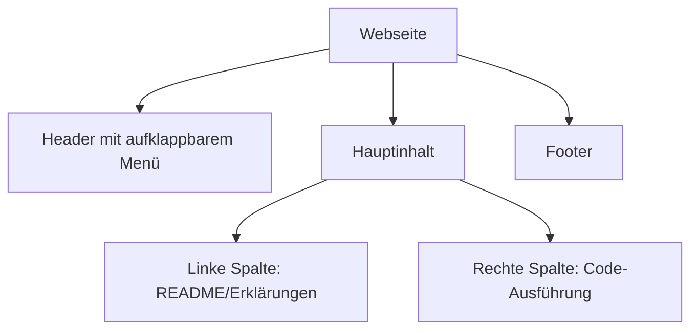
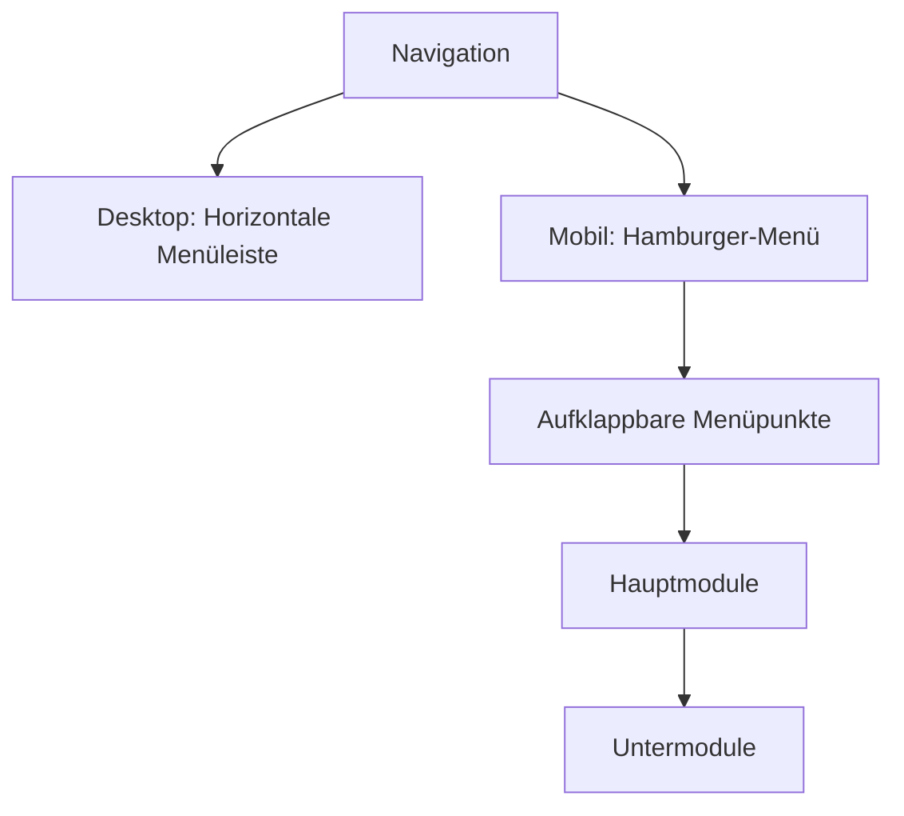
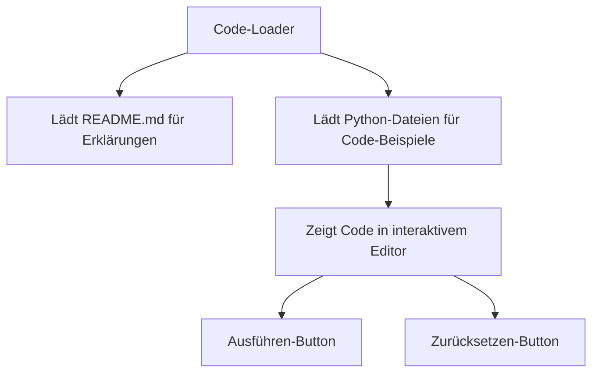

# Verbesserungsplan für die Python-Lernwebseite

## Aktuelle Probleme

1. Die Pfade zu den Python-Dateien sind nicht korrekt konfiguriert
2. Das Layout ist nicht optimal für das gleichzeitige Anzeigen von Erklärungen und Code
3. Die Navigation ist nicht mobil-optimiert
4. Die README-Dateien werden nicht effektiv genutzt

## Aktueller Status
- Die Webseite wurde mit Jekyll auf GitHub Pages deployed
- Die Python-Dateien befinden sich in den Ordnern `docs/anleitungen/01_grundlagen/` bis `docs/anleitungen/09_projekte/`
- Die Fibonacci-Beispieldatei wurde in `docs/anleitungen/beispiel_code/fibonacci.py` kopiert
- Die Pfade in den Markdown-Dateien wurden angepasst, aber die Webseite zeigt den Code nicht korrekt an

## Lösungsvorschlag

### 1. Zweispaltiges Layout

- **Linke Spalte**: Zeigt die README-Dateien oder Erklärungen an
- **Rechte Spalte**: Zeigt den Python-Code mit interaktiver Ausführungsmöglichkeit

### 2. Mobil-optimierte Navigation

- Hamburger-Menü für mobile Geräte
- Aufklappbare Untermenüs für die verschiedenen Module
- Einfache Navigation zwischen den verschiedenen Themen

### 3. Verbesserte Code-Loader-Funktionalität

- Automatisches Laden der README-Dateien für Erklärungen
- Laden der Python-Dateien für interaktive Code-Beispiele
- Buttons zum Ausführen und Zurücksetzen des Codes

### 4. Technische Änderungen

1. **Anpassung des Layouts**:
   - Flexbox oder Grid-Layout für das zweispaltige Design
   - Responsive Design für verschiedene Bildschirmgrößen

2. **JavaScript-Verbesserungen**:
   - Korrektur der Pfade in `code-loader.js` (aktuell auf `/py/anleitungen/${filePath}` gesetzt)
   - Implementierung des aufklappbaren Menüs
   - Verbesserung der Interaktivität

3. **CSS-Anpassungen**:
   - Stile für das zweispaltige Layout
   - Mobil-optimierte Stile
   - Verbesserte Lesbarkeit

## Implementierungsschritte

1. Anpassung des HTML-Layouts in `_layouts/default.html`
2. Aktualisierung der CSS-Stile in `assets/css/style.css`
3. Verbesserung der JavaScript-Funktionalität in `assets/js/code-loader.js`
4. Korrektur der Pfade in den Markdown-Dateien
5. Testen auf verschiedenen Geräten

## Ziel
Eine benutzerfreundliche Python-Lernwebseite mit:
- Übersichtlicher Darstellung von Erklärungen und Code nebeneinander
- Einfacher Navigation, besonders auf mobilen Geräten
- Korrekter Anzeige und Ausführung der Python-Beispiele
- Möglichkeit, den Code direkt auf der Webseite auszuführen und zu experimentieren
